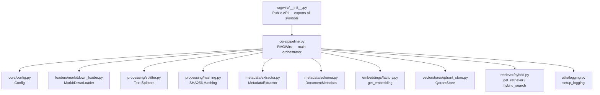
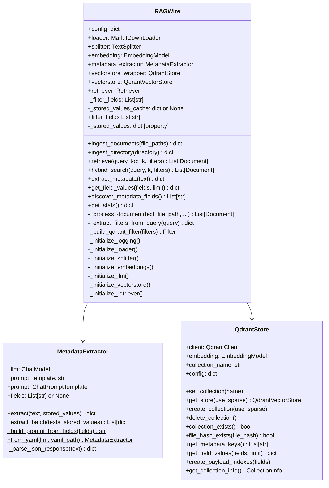
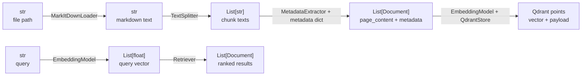

# Component Map

How all modules in the RAGWire package relate to each other — who owns what, who calls whom, and which external libraries each component depends on.

---

## Module Dependency Graph

---

## External Library Mapping

| RAGWire Module | Third-Party Libraries | Notes |
|---|---|---|
| `markitdown_loader.py` | `markitdown` | Document → Markdown conversion |
| `splitter.py` | `langchain-text-splitters` | Markdown + recursive splitting |
| `extractor.py` | `langchain-core` (ChatPromptTemplate) | Prompt building + LLM chain |
| `schema.py` | `pydantic` | Metadata schema validation |
| `factory.py` (embeddings) | `langchain-openai` · `langchain-ollama` · `langchain-huggingface` · `langchain-google-genai` | Lazy import — only the configured provider is loaded |
| `qdrant_store.py` | `qdrant-client` · `langchain-qdrant` · `fastembed` | `fastembed` only needed for hybrid search |
| `hybrid.py` | `langchain-qdrant` (QdrantVectorStore) | Similarity / MMR / hybrid retrieval |
| `config.py` | `pyyaml` · `python-dotenv` | YAML loading + env var resolution |
| `pipeline.py` (LLM) | `langchain-openai` · `langchain-ollama` · `langchain-google-genai` · `langchain-groq` · `langchain-anthropic` | Lazy import — only the configured provider is loaded |

---

## RAGWire Class — Internal State

---

## Data Types Flowing Through the Pipeline

