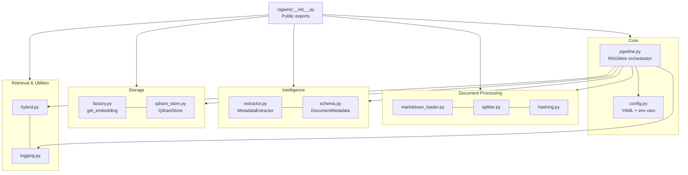
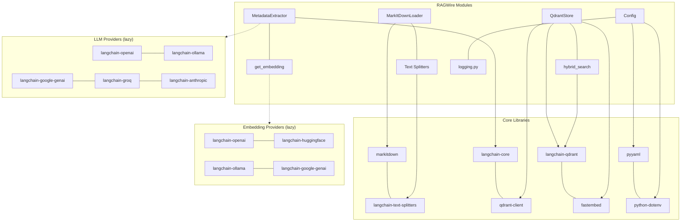
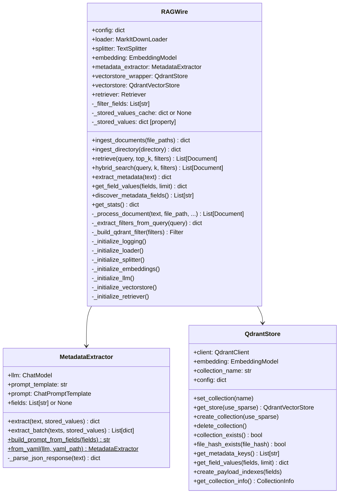
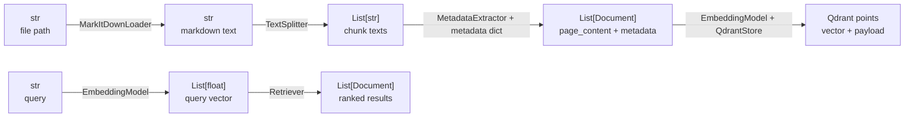

# Component Map

How all modules in the RAGWire package relate to each other — who owns what, who calls whom, and which external libraries each component depends on.

---

## Module Dependency Graph

---

## External Library Mapping

Dashed lines = lazy imports (only loaded when that provider is configured).

---

## RAGWire Class — Internal State

---

## Data Types Flowing Through the Pipeline

