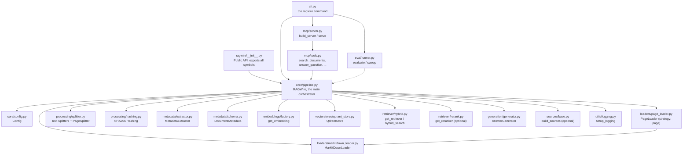
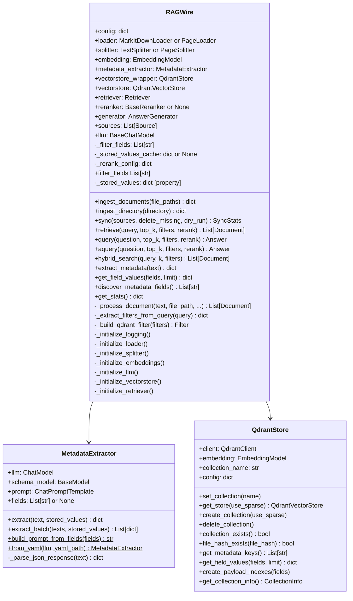
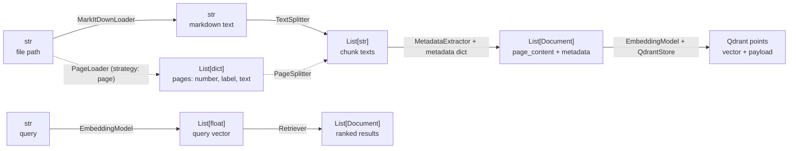

# Component Map

How all modules in the RAGWire package relate to each other: who owns what, who calls whom, and which external libraries each component depends on.

---

## Module Dependency Graph

```mermaid
graph TD
    INIT["ragwire/__init__.py\nPublic API, exports all symbols"]
    INIT --> PIPE

    PIPE["core/pipeline.py\nRAGWire, the main orchestrator"]

    PIPE --> CFG["core/config.py\nConfig"]
    PIPE --> LOAD["loaders/markitdown_loader.py\nMarkItDownLoader"]
    PIPE --> PLOAD["loaders/page_loader.py\nPageLoader (strategy: page)"]
    PLOAD --> LOAD
    PIPE --> SPLIT["processing/splitter.py\nText Splitters + PageSplitter"]
    PIPE --> HASH["processing/hashing.py\nSHA256 Hashing"]
    PIPE --> EXT["metadata/extractor.py\nMetadataExtractor"]
    PIPE --> SCH["metadata/schema.py\nDocumentMetadata"]
    PIPE --> EMB["embeddings/factory.py\nget_embedding"]
    PIPE --> QS["vectorstores/qdrant_store.py\nQdrantStore"]
    PIPE --> HYB["retriever/hybrid.py\nget_retriever / hybrid_search"]
    PIPE --> RRK["retriever/rerank.py\nget_reranker (optional)"]
    PIPE --> GEN["generation/generator.py\nAnswerGenerator"]
    PIPE --> SRC["sources/base.py\nbuild_sources (optional)"]
    PIPE --> LOG["utils/logging.py\nsetup_logging"]

    CLI["cli.py\nthe ragwire command"] --> PIPE
    CLI --> MCP["mcp/server.py\nbuild_server / serve"]
    CLI --> EVAL["eval/runner.py\nevaluate / sweep"]
    MCP --> MTOOL["mcp/tools.py\nsearch_documents, answer_question, ..."]
    MTOOL -.-> PIPE
    EVAL -.-> PIPE
```

Two of these deliberately do not depend on `RAGWire`. `eval/` calls whatever
`retrieve` it is handed, and `mcp/tools.py` takes the pipeline as an argument,
so both are testable without a vector store and reusable outside the package.

`generation/` is the same shape one level down: `AnswerGenerator` is given
documents and returns an `Answer`, holding no retrieval logic of its own.

---

## External Library Mapping

| RAGWire Module | Third-Party Libraries | Notes |
|---|---|---|
| `markitdown_loader.py` | `markitdown` | Document → Markdown conversion |
| `page_loader.py` | `pypdf` · `python-pptx` | Page-preserving extraction (PDF pages, PPTX slides) for the `page` strategy |
| `splitter.py` | `langchain-text-splitters` | Markdown + recursive splitting; `PageSplitter` itself needs nothing beyond the stdlib |
| `extractor.py` | `langchain-core` (ChatPromptTemplate) | Prompt building + LLM chain |
| `schema.py` | `pydantic` | Metadata schema validation |
| `factory.py` (embeddings) | `langchain-openai` · `langchain-ollama` · `langchain-huggingface` · `langchain-google-genai` · `openrouter` | Lazy import; only the configured provider is loaded |
| `qdrant_store.py` | `qdrant-client` · `langchain-qdrant` · `fastembed` | `fastembed` only needed for hybrid search |
| `hybrid.py` | `langchain-qdrant` (QdrantVectorStore) | Similarity / MMR / hybrid retrieval |
| `rerank.py` | `sentence-transformers` · `cohere` | Optional; lazy import, and the cross-encoder model itself loads only on first use |
| `generator.py` | `langchain-core` | Grounded answers with citations |
| `eval/` | nothing beyond `pyyaml` | Golden sets and metrics are plain arithmetic |
| `sources/s3.py` | `boto3` | Optional; `local.py` needs nothing |
| `mcp/server.py` | `mcp` | Optional; `mcp/tools.py` needs nothing |
| `config.py` | `pyyaml` · `python-dotenv` | YAML loading + env var resolution |
| `pipeline.py` (LLM) | `langchain-openai` · `langchain-ollama` · `langchain-openrouter` · `langchain-google-genai` · `langchain-groq` · `langchain-anthropic` | Lazy import; only the configured provider is loaded |

---

## RAGWire Class: Internal State

```mermaid
classDiagram
    class RAGWire {
        +config: dict
        +loader: MarkItDownLoader or PageLoader
        +splitter: TextSplitter or PageSplitter
        +embedding: EmbeddingModel
        +metadata_extractor: MetadataExtractor
        +vectorstore_wrapper: QdrantStore
        +vectorstore: QdrantVectorStore
        +retriever: Retriever
        +reranker: BaseReranker or None
        +generator: AnswerGenerator
        +sources: List[Source]
        +llm: BaseChatModel
        -_filter_fields: List[str]
        -_stored_values_cache: dict or None
        -_rerank_config: dict

        +ingest_documents(file_paths) dict
        +ingest_directory(directory) dict
        +sync(sources, delete_missing, dry_run) SyncStats
        +retrieve(query, top_k, filters, rerank) List[Document]
        +query(question, top_k, filters, rerank) Answer
        +aquery(question, top_k, filters, rerank) Answer
        +hybrid_search(query, k, filters) List[Document]
        +extract_metadata(text) dict
        +get_field_values(fields, limit) dict
        +filter_fields List[str]
        +discover_metadata_fields() List[str]
        +get_stats() dict

        -_process_document(text, file_path, ...) List[Document]
        -_extract_filters_from_query(query) dict
        -_build_qdrant_filter(filters) Filter
        -_stored_values: dict [property]
        -_initialize_logging()
        -_initialize_loader()
        -_initialize_splitter()
        -_initialize_embeddings()
        -_initialize_llm()
        -_initialize_vectorstore()
        -_initialize_retriever()
    }

    class MetadataExtractor {
        +llm: ChatModel
        +schema_model: BaseModel
        +prompt: ChatPromptTemplate
        +fields: List[str] or None

        +extract(text, stored_values) dict
        +extract_batch(texts, stored_values) List[dict]
        +build_prompt_from_fields(fields)$ str
        +from_yaml(llm, yaml_path)$ MetadataExtractor
        -_parse_json_response(text) dict
    }

    class QdrantStore {
        +client: QdrantClient
        +embedding: EmbeddingModel
        +collection_name: str
        +config: dict

        +set_collection(name)
        +get_store(use_sparse) QdrantVectorStore
        +create_collection(use_sparse)
        +delete_collection()
        +collection_exists() bool
        +file_hash_exists(file_hash) bool
        +get_metadata_keys() List[str]
        +get_field_values(fields, limit) dict
        +create_payload_indexes(fields)
        +get_collection_info() CollectionInfo
    }

    RAGWire --> MetadataExtractor
    RAGWire --> QdrantStore
```

---

## Data Types Flowing Through the Pipeline

```mermaid
flowchart LR
    F["str\nfile path"] -->|"MarkItDownLoader"| MD["str\nmarkdown text"]
    F -.->|"PageLoader (strategy: page)"| PG["List[dict]\npages: number, label, text"]
    MD -->|"TextSplitter"| CL["List[str]\nchunk texts"]
    PG -.->|"PageSplitter"| CL
    CL -->|"MetadataExtractor + metadata dict"| DL["List[Document]\npage_content + metadata"]
    DL -->|"EmbeddingModel + QdrantStore"| VEC["Qdrant points\nvector + payload"]

    Q["str\nquery"] -->|"EmbeddingModel"| QV["List[float]\nquery vector"]
    QV -->|"Retriever"| RES["List[Document]\nranked results"]
```
