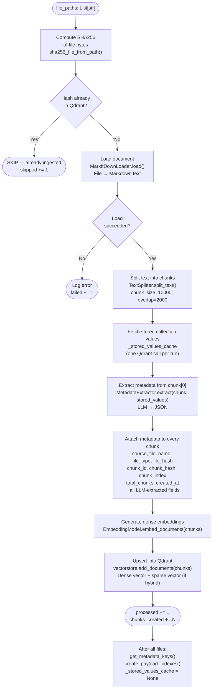
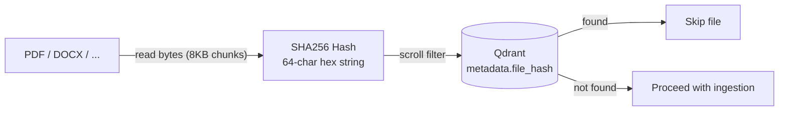
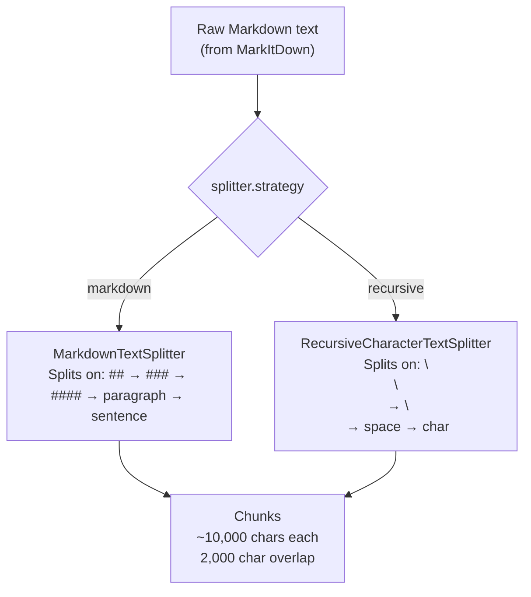
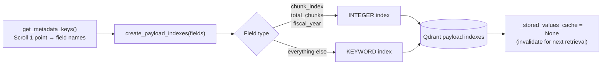

# Ingestion Pipeline

The ingestion pipeline converts raw files into searchable vector chunks stored in Qdrant. It runs once per document (re-ingesting the same file is a no-op thanks to SHA256 deduplication).

---

## Step-by-Step Flow



---

## Deduplication



The hash is computed by streaming the file in 8 KB chunks — memory-safe for large PDFs. The same hash is stored as `file_hash` in every chunk's metadata, so a single Qdrant scroll query can check for existence.

---

## Chunk Metadata Structure

Every chunk stored in Qdrant carries the following payload:

```
metadata/
├── LLM-extracted (once per document, from chunk[0])
│   ├── company_name      "apple inc."
│   ├── doc_type          "10-k"
│   ├── fiscal_quarter    null
│   └── fiscal_year       [2025]
│
├── File-level (from file system)
│   ├── source            "/data/Apple_10k_2025.pdf"
│   ├── file_name         "Apple_10k_2025.pdf"
│   ├── file_type         "pdf"
│   └── file_hash         "a1b2c3..."
│
└── Chunk-level (per chunk)
    ├── chunk_id          "a1b2c3_0"
    ├── chunk_hash        SHA256(chunk_id + content)
    ├── chunk_index       0
    ├── total_chunks      42
    └── created_at        "2025-01-01T00:00:00+00:00"
```

---

## Text Splitting Strategy



Overlap ensures context is not lost when a sentence spans a chunk boundary.

---

## Post-Ingestion Indexing

After all files are processed, RAGWire creates payload indexes on every metadata field so Qdrant's facet API works for filter extraction:


