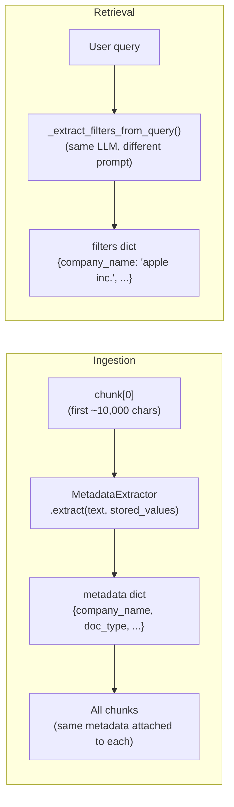
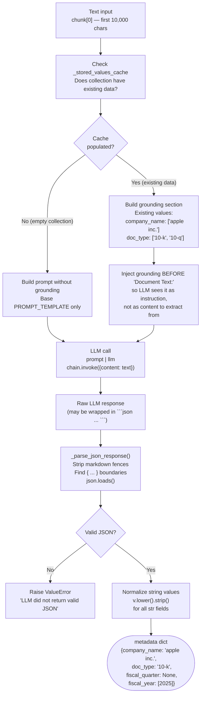
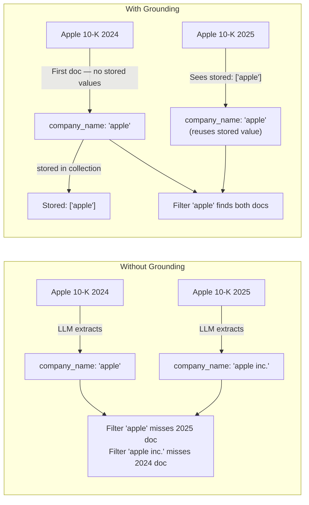
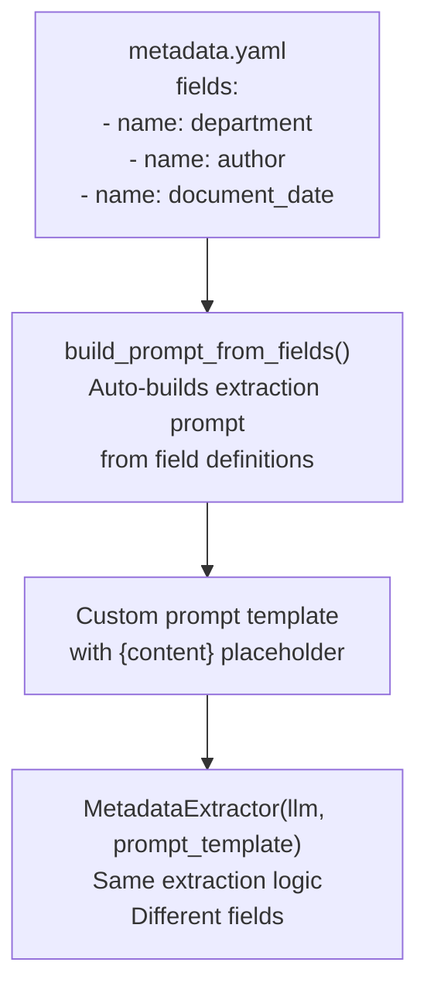

# Metadata Extraction

Metadata extraction is the intelligence layer of RAGWire. It uses an LLM to read the first chunk of every document and produce structured JSON fields that are later used for precise filtering at retrieval time.

---

## Where Metadata Extraction Fits



---

## Extraction Flow (Ingestion Time)



---

## Prompt Structure

The LLM receives a structured prompt. Grounding is injected **before** the document content section so it acts as an instruction, not data:

```
┌─────────────────────────────────────────────────────┐
│  SYSTEM INSTRUCTION                                 │
│  "You are a financial document metadata extractor"  │
│  "Return ONLY valid JSON in this format: { ... }"   │
├─────────────────────────────────────────────────────┤
│  GROUNDING (only when collection has data)          │
│  "Existing values in the collection:                │
│     company_name: ['apple inc.', 'microsoft']       │
│   Use stored value if this document is same entity" │
├─────────────────────────────────────────────────────┤
│  DOCUMENT TEXT                                      │
│  "Document Text:                                    │
│   {content — first 10,000 chars}"                   │
├─────────────────────────────────────────────────────┤
│  OUTPUT MARKER                                      │
│  "Extracted Metadata (JSON only):"                  │
│  ↑ LLM starts generating here                       │
└─────────────────────────────────────────────────────┘
```

---

## Grounding — Why It Matters

Without grounding, the same company can be stored under multiple names across ingestion runs:



---

## Custom Metadata via YAML

By default, RAGWire extracts 4 financial fields. You can define any fields via `metadata.yaml`:



The `from_yaml()` classmethod handles this automatically — no code change needed, just point `metadata.config_file` to your YAML.

---

## JSON Parsing Robustness

LLMs sometimes wrap JSON in markdown code fences. The parser handles all variants:

```
Input variants handled:
  ```json              → stripped
  { ... }              ```
  ```                  → stripped
  { ... }              ```
  Some text { ... }    → find first { and last }
  { ... }              → used as-is
```
