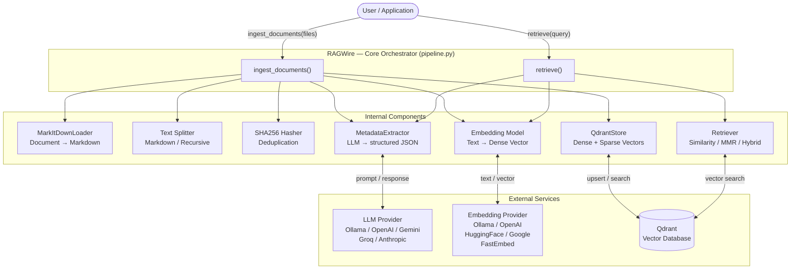

# RAGWire — System Overview

RAGWire is a production-grade RAG (Retrieval-Augmented Generation) toolkit. It has two primary workflows: **Ingestion** (storing documents) and **Retrieval** (finding relevant chunks for a query). Both are orchestrated by the central `RAGWire` class.

---

## High-Level Architecture



---

## Two Workflows at a Glance

| | Ingestion | Retrieval |
|---|---|---|
| **Input** | List of file paths | Natural language query |
| **Output** | Stats dict (processed, skipped, chunks) | List of `Document` objects |
| **LLM used for** | Extracting metadata from document content | Extracting filters from query |
| **Qdrant operation** | `add_documents` (upsert) | `similarity_search` / hybrid search |
| **Deduplication** | SHA256 file hash checked before ingestion | — |
| **Caching** | `_stored_values_cache` invalidated after run | `_stored_values_cache` populated on first call |

---

## Configuration-Driven Design

Everything is driven by `config.yaml`. The `Config` class loads the YAML, resolves `${ENV_VAR}` placeholders, and returns a plain dict. Each component reads its own section:

```
config.yaml
├── loader       → MarkItDownLoader (file extensions)
├── splitter     → Text splitter (chunk_size, strategy)
├── embeddings   → Embedding factory (provider, model)
├── llm          → LLM factory (provider, model) + MetadataExtractor
├── metadata     → Optional custom metadata YAML path
├── vectorstore  → QdrantStore (url, collection, use_sparse)
├── retriever    → Retriever (search_type, top_k)
└── logging      → Logging setup (level, colored, log_file)
```
