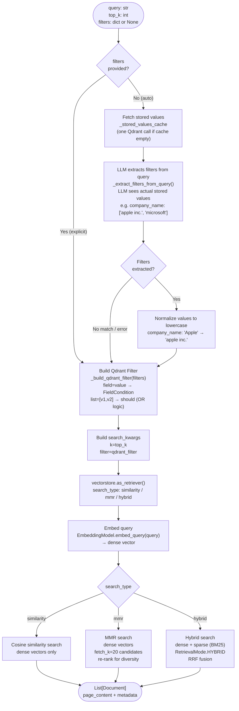
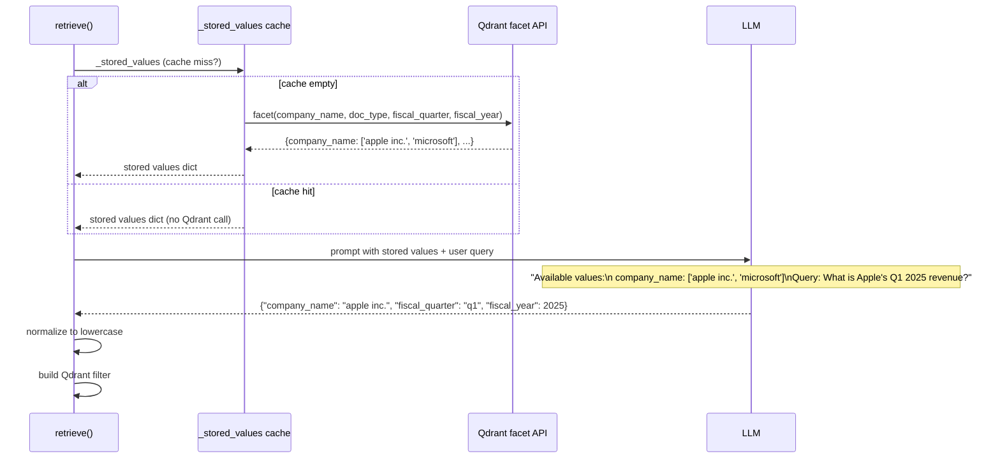
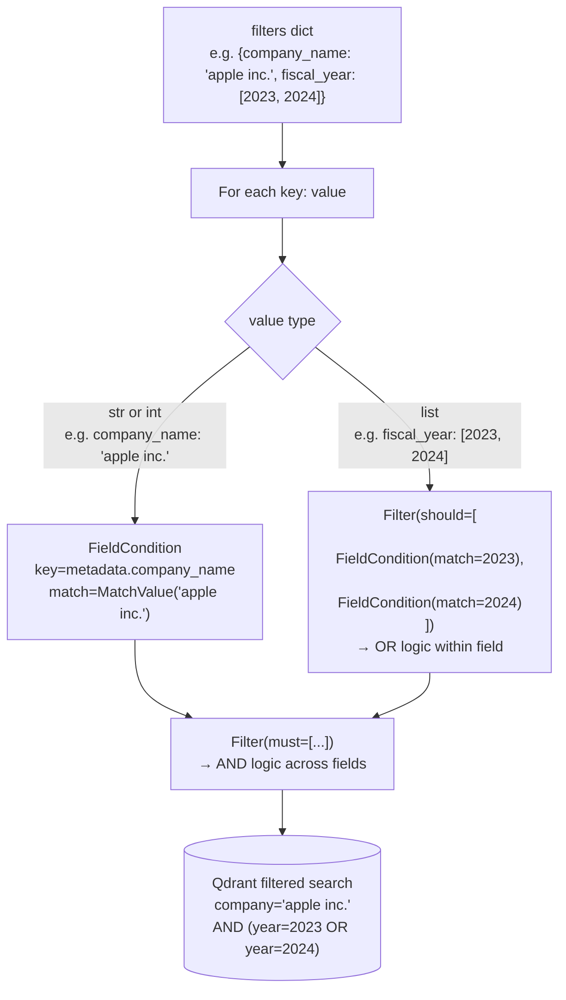
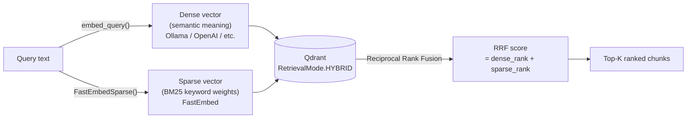
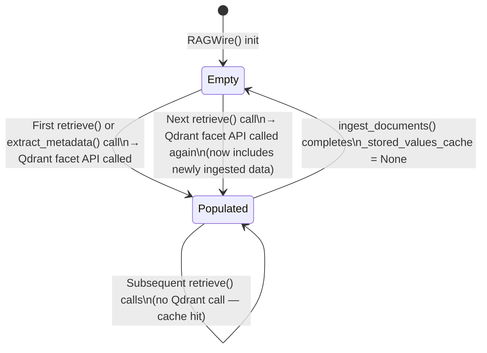

# Retrieval Pipeline

The retrieval pipeline takes a natural language query and returns the most relevant document chunks from Qdrant. It uses the LLM to automatically extract metadata filters from the query so results are scoped to the right company, year, or document type — without the user having to pass filters manually.

---

## Step-by-Step Flow

---

## Auto-Filter Extraction Detail

When no filters are passed, the LLM is shown the **exact values stored in Qdrant** and asked to match:

---

## Filter Building Logic

---

## Hybrid Search Internals

Hybrid search is only active when `use_sparse: true` in config and `fastembed` is installed. If `fastembed` is missing, RAGWire falls back to dense-only search with a warning.

---

## Stored Values Cache Lifecycle

