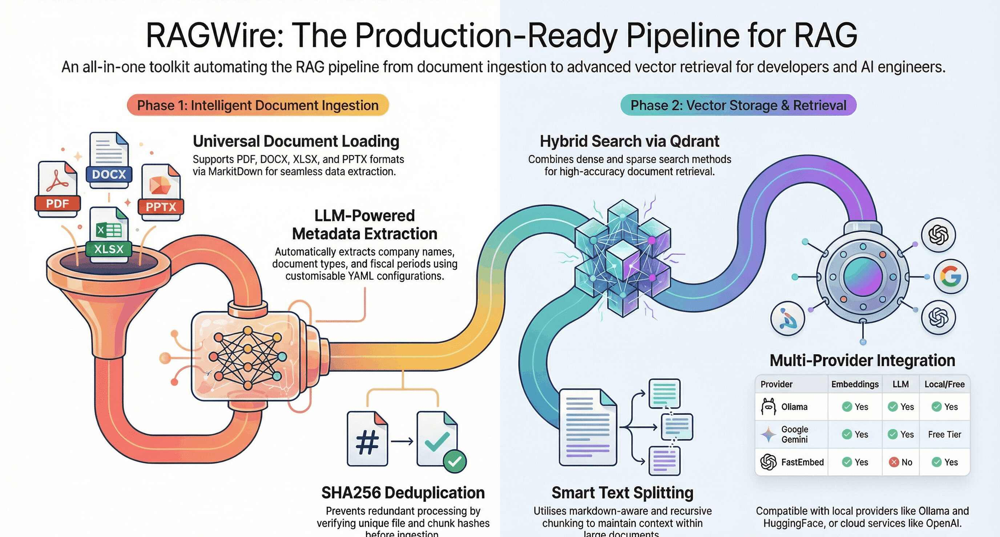
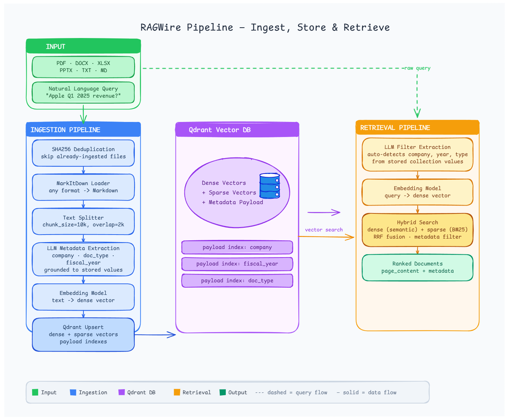

# RAGWire

**Production-grade RAG toolkit for document ingestion and retrieval with hybrid search support.**

RAGWire handles the full RAG pipeline, from loading raw documents to storing and retrieving them from a vector database, so you can focus on building your application.

---



---

## Features

**Ingestion**

- **Document Loading**: PDF, DOCX, XLSX, PPTX and more via MarkItDown
- **LLM Metadata Extraction**: extracts company, doc type, and fiscal period automatically
- **Smart Text Splitting**: markdown-aware and recursive chunking strategies
- **SHA256 Deduplication**: at both file and chunk level, so nothing is ingested twice
- **[Source Sync](cookbook/syncing_sources.md)**: reconcile against local folders and S3, including the deletions plain ingestion never notices

**Retrieval and answers**

- **Multiple Embedding Providers**: Ollama, OpenAI, OpenRouter, HuggingFace, Google, FastEmbed
- **Qdrant Vector Store**: dense, sparse, and hybrid search
- **Advanced Retrieval**: similarity, MMR, and hybrid search with metadata filtering
- **[Reranking](cookbook/reranking.md)**: optional cross-encoder second stage, local and API-key-free by default
- **[Grounded Answers](cookbook/answering_questions.md)**: cited answers that refuse rather than guess, sync and async

**Operating it**

- **[Evaluation](cookbook/evaluation.md)**: recall@k, MRR and config sweeps against your own golden set
- **[MCP Server](cookbook/mcp_server.md)**: expose a collection to Claude Desktop, Claude Code and Cursor
- **CLI**: `ragwire ingest`, `sync`, `eval` and `mcp serve`

---

## Architecture



---

## Installation

```bash
pip install ragwire

# With Ollama support (local, no API key)
pip install "ragwire[ollama]"

# Optional capabilities
pip install "ragwire[rerank]"   # local cross-encoder reranking, no API key
pip install "ragwire[mcp]"      # MCP server for Claude Desktop / Code / Cursor
pip install "ragwire[s3]"       # S3 source connector for rag.sync()

# Everything
pip install "ragwire[all]"
```

None of the optional extras are needed for the core install, and evaluation needs no extra package at all.

---

## Quick Start

```python
from ragwire import RAGWire

rag = RAGWire("config.yaml")

# Ingest documents
stats = rag.ingest_documents(["data/Apple_10k_2025.pdf"])
print(f"Chunks created: {stats['chunks_created']}")

# Ask a question and get a cited answer
answer = rag.query("What is Apple's total revenue?")
print(answer.formatted())

# Or work with the chunks directly
results = rag.retrieve("What is Apple's total revenue?", top_k=5)
for doc in results:
    print(doc.metadata.get("company_name"), doc.page_content[:200])
```

---

## Where To Go Next

| If you want to | Read |
|---|---|
| Get running from scratch | [Installation & Setup](setup.md) |
| Follow a worked example | [Quick Tutorial](tutorial.md) |
| Get answers rather than chunks | [Answer Questions](cookbook/answering_questions.md) |
| Improve result quality | [Reranking](cookbook/reranking.md) |
| Find out whether a change helped | [Measure Retrieval Quality](cookbook/evaluation.md) |
| Use your documents from Claude or Cursor | [MCP Server](cookbook/mcp_server.md) |
| Keep the collection current automatically | [Sync Sources](cookbook/syncing_sources.md) |
| Scope queries to the right documents | [Metadata & Filtering](metadata.md) |

---

## Supported Providers

| Provider | Embeddings | LLM | Free |
|---|---|---|---|
| [Ollama](ollama.md) | Yes | Yes | Yes (local) |
| [OpenAI](openai.md) | Yes | Yes | No |
| [OpenRouter](openrouter.md) | Yes | Yes | Free tier |
| [Google Gemini](gemini.md) | Yes | Yes | Free tier |
| [Groq](groq.md) | No | Yes | Free tier |
| [Anthropic](anthropic.md) | No | Yes | No |
| [HuggingFace](huggingface.md) | Yes | No | Yes (local) |
| [FastEmbed](fastembed.md) | Yes | No | Yes (local) |

---

## Links

- **GitHub**: [github.com/laxmimerit/RAGWire](https://github.com/laxmimerit/RAGWire)
- **PyPI**: [pypi.org/project/ragwire](https://pypi.org/project/ragwire)
- **YouTube**: [youtube.com/kgptalkie](https://youtube.com/kgptalkie)
- **Website**: [kgptalkie.com](https://kgptalkie.com)
